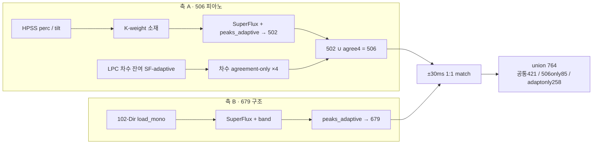
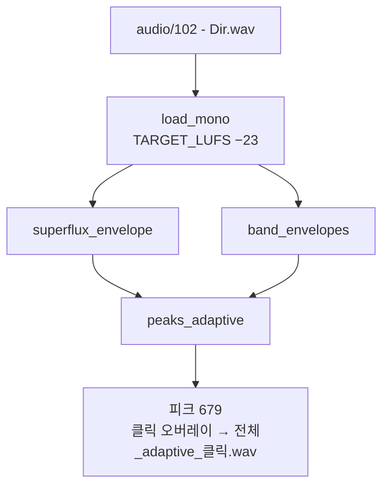
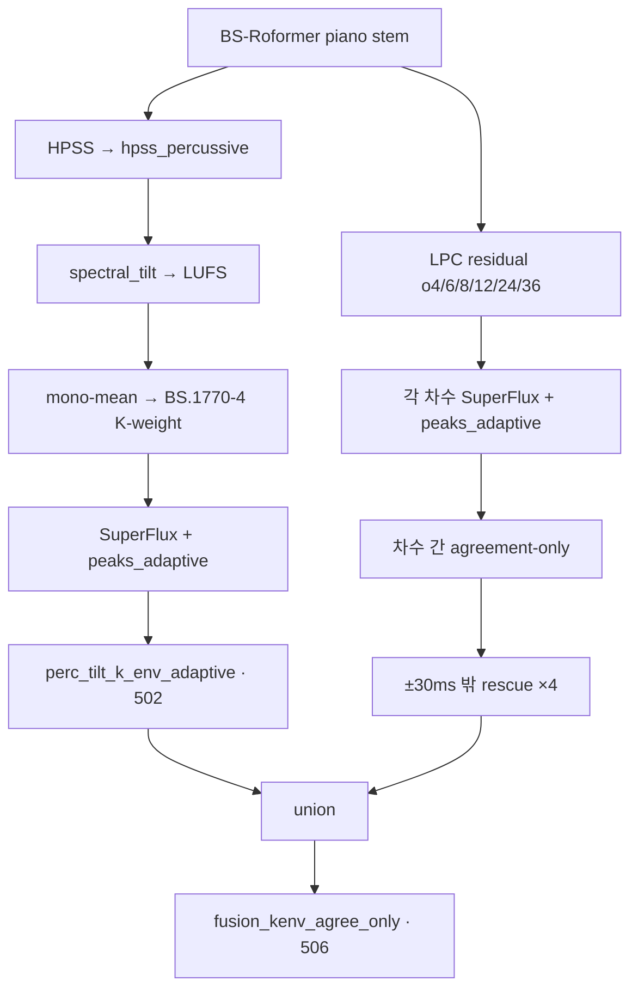
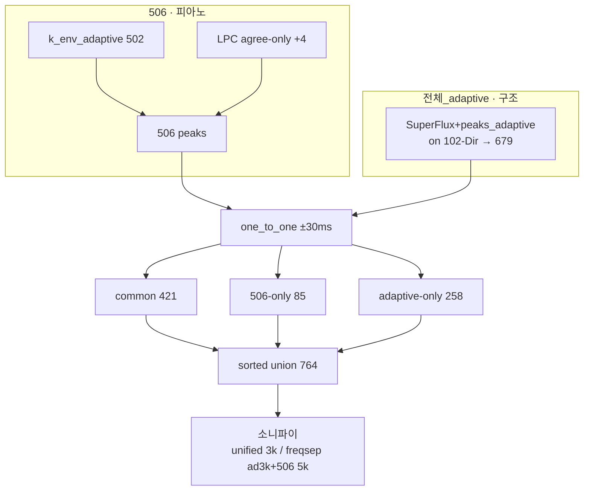

# Dir 사건 파이프라인 — 전체_adaptive · 506 · 764

> 2026-08-10 · 대상: `102 - Dir.wav`  
> 현 시점 Dir **통합본 = 764** (`506 ∪ 전체_adaptive`).  
>  Continuity: [`HANDOFF.md`](../HANDOFF.md) · 자문 배경: [`s4_piano_advisory.md`](s4_piano_advisory.md) · LPC rescue 양: [`lpc_rescue_contribution.md`](lpc_rescue_contribution.md)

이 문서는 Dir에서 쓰는 **세 층**을 소개한다.

| 이름 | n | 역할 |
|------|--:|------|
| **전체_adaptive** | 679 | 저역 비트·구조적 사건 |
| **506** | 506 | 피아노 건반 사건 |
| **764** | 764 | 위 둘의 ±30ms 합집합 (통합본) |

---

## 0. 한눈에 — 764 구조

청취 판정(세션 38): **506 = 피아노**, **전체_adaptive = 저역 비트·기타 구조**.  
단독·비교 소니파이 청취 후 역할 분담을 확정하고, 통합본으로 **764**를 채택했다.

---

## 1. 전체_adaptive 방식 (n=679)

본선 4곡과 같은 **원곡 위 SuperFlux + `peaks_adaptive`** 계열이다.  
Dir에서는 `out/sonify/Dir/전체_adaptive_클릭.wav`가 참조 산출이다.

### 흐름

### `peaks_adaptive`가 하는 일

`src/peak_pick.py` — block-gated adaptive + Q1 rescue:

1. **block-gate** (기본 16s): 보이는 블록 → Otsu, 안 보이는 블록 → local norm
2. **norm 잔여 합산**: gate에 없고 norm에만 있는 피크도 포함
3. **Q1 prototype rescue**: 구조적으로 비슷한 잔여 피크
4. **최소 간격** 탐욕 선택 (`MIN_EVENT_GAP_S`)

### 강점 / 한계

- **강점**: 원곡 저역·리듬·구조 사건을 넓게 잡음. 본선과 동일 검출 가족이라 해석이 익숙함.
- **한계**: 피아노 타건 전수에는 부족. Dir 초기에 지적된 “등간격 비트 artifact / 피아노 누락” 문제의 연장선에 있음 ([`s4_piano_advisory.md`](s4_piano_advisory.md)).

### 코드·산출

| 항목 | 경로 |
|------|------|
| 소니파이 생성 | `src/exp/s3_2d/_sonify_adaptive.py` |
| 피크 재계산(764용) | `run_cmp506_vs_dir_adaptive_lowpiano.py` → `load_adaptive_peaks()` |
| WAV | `out/sonify/Dir/전체_adaptive_클릭.wav` |

---

## 2. 506 방식 (피아노 전용 최선)

506은 **원곡 SuperFlux가 아니라**, stem event sculpt 소재 위에서 adaptive를 돌리고, LPC 합의 구조만 보수적으로 얹은 결과다.  
정의: **`perc_tilt_k_env_adaptive`(502) ∪ LPC-order agreement-only 4점**.  
o12-deburst 2k×21은 **제외** (보수본; 포함 시 527은 보류).

### 흐름

### 소재 체인 (502)

`run_tilt_k_env_adaptive.py` — `전체_adaptive`와 **같은 피크 함수**, **다른 오디오 소재**:

1. `hpss_percussive`
2. spectral tilt → LUFS (−23)
3. mono mean → K-weight
4. SuperFlux + `peaks_adaptive` → **502**

이전 `perc_tilt_k_env`(RMS→2s-p99→Otsu, 340)보다 adaptive가 피아노 반응에 유리했고, 세션 34에서 506의 베이스로 채택됐다.

### agreement rescue (×4)

여러 LPC 차수 SF-adaptive 피크 중 **차수 간 합의만** 남기고, 이미 502에 ±30ms 안이면 버리고 **밖만 4점** 추가.  
오탐이 섞이기 쉬운 o12-deburst(2k×21)는 넣지 않는다.

### 강점 / 한계

- **강점**: 피아노 건반 사건에 특화. 청취상 오른손·타건 밀도가 506 쪽에서 더 설득력 있음.
- **한계**: 저역 비트·비피아노 구조는 상대적으로 약함 → 단독으로는 Dir “전체 사건” 통합본이 되기 어렵다.

### 코드·산출

| 항목 | 경로 |
|------|------|
| k_env adaptive | `run_tilt_k_env_adaptive.py` |
| LPC agreement | `run_lpc_order_agreement_on_piano.py` |
| fusion (506/527) | `run_fusion_kenv_agree_o12_on_piano.py` |
| 매니페스트 키 | `conservative_kenv_agree_only` |
| WAV | `…/fusion_kenv_agree_only_on_piano_클릭_p506.wav` (+ low / freqsep) |

---

## 3. 764 파이프라인 (Dir 통합본)

764는 **새 ODF가 아니다**. 축 A(506)와 축 B(679)를 시간축에서 합친 것이다.

### 매칭 규칙

- 함수: `one_to_one_time_match` (`_onset_wtmm_fusion`)
- 허용: **±30ms**
- 결과:
  - 공통 **421**
  - 506-only **85**
  - adaptive-only **258**
  - **union = 764**

### 통합 도식 (상세)

### 소니파이 변형

| 종류 | bed | 클릭 |
|------|-----|------|
| piano low | BS piano ×0.20 | unified 3kHz / freqsep(ad 3k, 506 5k) |
| origmix raw | 원곡 mono mean, 무LUFS | 동일 |
| origmix lufs | `load_mono` (=전체_adaptive 레벨) | 동일 |
| `origmix_g*` | raw 별칭 | 동일 |

러너:

- `run_cmp506_vs_dir_adaptive_lowpiano.py`
- `run_cmp506_vs_dir_adaptive_original.py`

대표 WAV:

- `…/cmp506_vs_dirAdaptive_low_g0p20_{unified3k\|freqsep}_클릭_p764_*.wav`
- `…/cmp506_vs_dirAdaptive_origmix_{raw\|lufs}_g{1p00\|0p20}_{unified3k\|freqsep}_*.wav`

### 품질 지표 (참고)

stem 합의 포괄률 (분모 234, ±30ms):

| 후보 | n | coverage | missed |
|------|--:|--------:|-------:|
| `union_506_or_dirAdaptive` (**764**) | 764 | **99.1%** | **2** |
| `fusion_kenv_agree_only` (506) | 506 | 94.0% | 14 |
| `dir_전체_adaptive` | 679 | 92.7% | 17 |

선결 과제: 764의 stem합의 **missed 2** 청취 판정
(`1:22.039`, `1:32.816`).

### stem 합의 234 소니파이

잠긴 분모 자체를 들을 수 있게 산출 (`run_stem_consensus_234_sonify.py`).

| 역할 | 파일 (under `…/lpc_sf_adaptive_on_piano/`) |
|------|---------------------------------------------|
| unified | `stem_consensus_234_low_g0p20_unified3k_클릭_p234.wav` |
| vote freqsep | `…_freqsep_클릭_p234_v3_132_v2_102.wav` (3of3=3k / 2of3=5k) |
| vs764 | `…_vs764_…_freqsep_클릭_p234_c232_m2.wav` (covered=3k / miss=5k) |
| miss2 solo | `stem_consensus_234_missed_by_764_low_g0p20_클릭_p2.wav` |
| origmix LUFS | `stem_consensus_234_origmix_lufs_g1p00_{unified3k\|freqsep}_…` |

타임스탬프 표: `pass2/consensus_coverage/stem_consensus_234_sonify.md`  
(레거시 단일 오버레이: `out/sonify/Dir/전체_stem_consensus_all_클릭.wav`)

---

## 4. 언제 무엇을 쓰는가

| 목적 | 쓸 것 |
|------|--------|
| 피아노 타건만 | **506** |
| 저역·구조·본선 계열과 비교 | **전체_adaptive** (679) |
| Dir 전체 사건 통합 기준선 | **764** |
| stem 합의 분모 청취 | **234** 소니파이 (vote / vs764) |
| 역할 분리 청취 | freqsep (adaptive=3k / 506=5k) |

설계 요지: **한 검출기로 다 잡기**보다, 특화된 두 축을 합치는 쪽이 Dir에서 청취·포괄률 모두 나았다.
