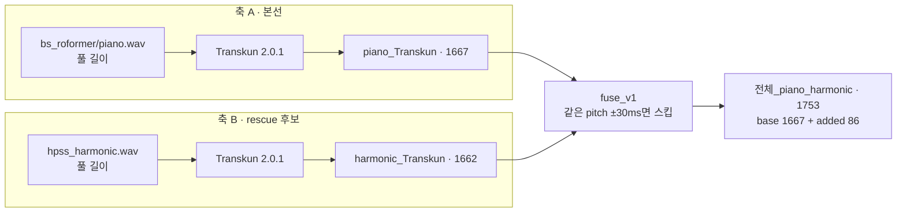
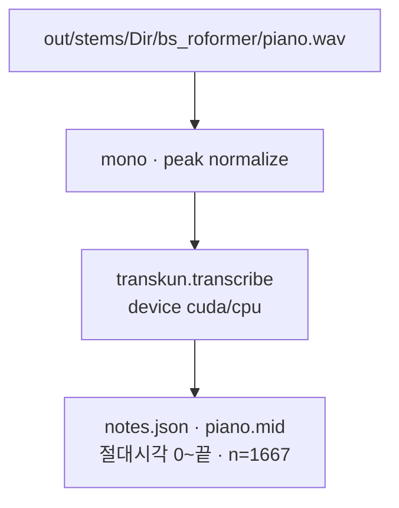
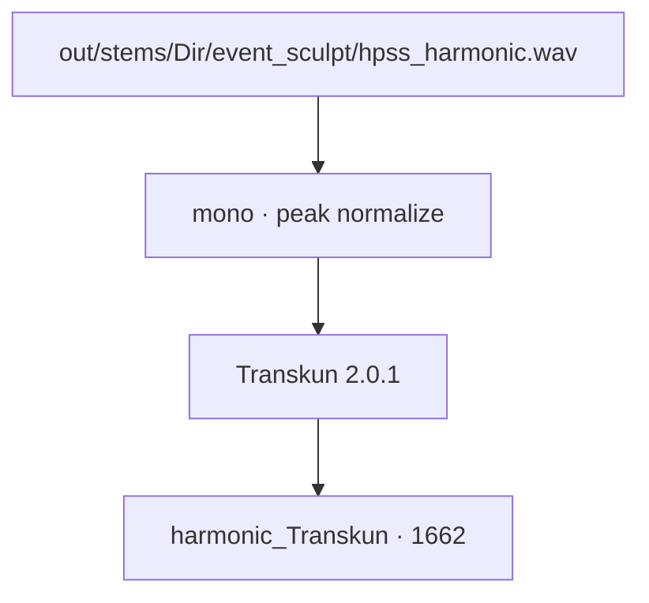
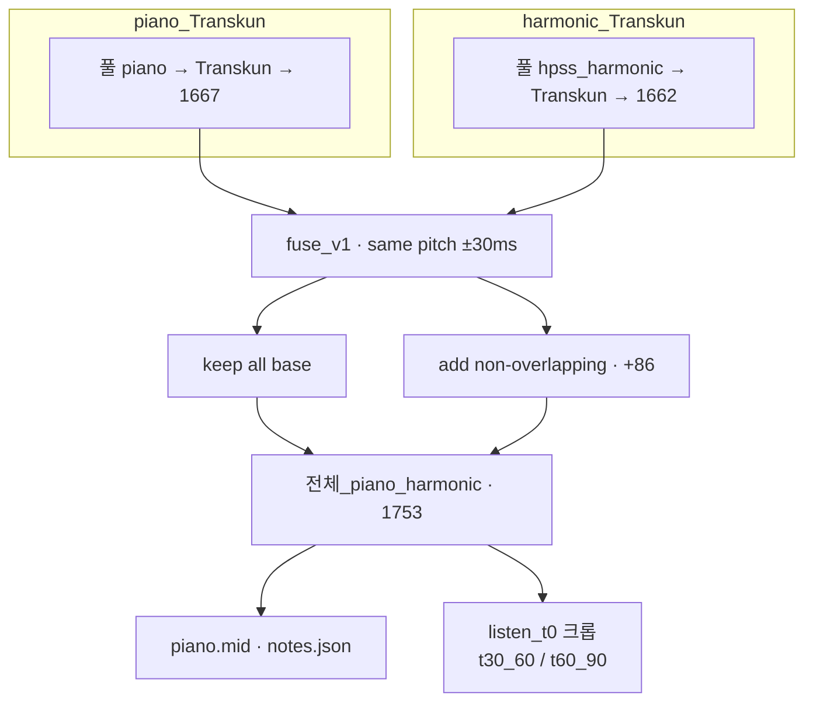

# Dir MIDI 파이프라인 — piano_Transkun · harmonic_rescue · 전체_piano_harmonic

> 2026-08-12 · 대상: Dir BS-Roformer piano (+ HPSS harmonic)  
> 현 시점 Dir **전곡 MIDI go** = **전체_piano_harmonic** (`piano.mid`, n=1753).  
> Continuity: [`HANDOFF.md`](../HANDOFF.md) · 청취 안내: [`../src/exp/s5_midi/midi_fuse/MIDI_GUIDE.md`](../src/exp/s5_midi/midi_fuse/MIDI_GUIDE.md) · 사건 축(별개): [`dir_764_pipeline.md`](dir_764_pipeline.md)

이 문서는 Dir **감상용 MIDI**에 쓰는 **세 층**을 소개한다.  
764 파이프라인(onset 클릭)과 **목적이 다르다** — 여기는 노트(onset·pitch·duration·velocity) 전사.

| 이름 | n | 역할 |
|------|--:|------|
| **piano_Transkun** | 1667 | 본선 — 풀 스템 피아노 AMT |
| **harmonic_Transkun** | 1662 | rescue 후보 — HPSS harmonic AMT (입력 전체) |
| **전체_piano_harmonic** | 1753 | 위 둘의 fuse_v1 합본 (본선 유지 + 같은 pitch±30ms 없으면 추가) |

파일럿(30–60s) go 잠금본 **clip⊕harmonic**(n=491)과 **같은 규칙**의 전곡 확장이다.

---

## 0. 한눈에 — 전체_piano_harmonic 구조



청취 판정(2026-08-12): **감상용으로 좋음** → go.  
“듣기 좋다” = **원곡을 해치지 않고 더 재현한다**고 해석.  
harmonic은 **실제 사건 증가 입증이 아니라** Transkun의 **짧은 노트**에 대한 **길이·밀도 보완(rescue)** + 청취 풍성함.

---

## 1. piano_Transkun 방식 (본선, n=1667)

풀 길이 피아노 스템에 Transkun만 돌린 결과.  
`전체_adaptive`가 원곡 위 ODF인 것과 달리, 여기는 **스템 AMT**.

### 흐름



### 강점 / 한계

- **강점**: Dir 피아노 선율·화성의 **원본 데이터 기반** 전사. 파일럿 clip AMT와 같은 가족.
- **한계**: 노트 **길이가 짧은** 편 → 단독 청취 시 건조·끊김. 배음/왼손·서스테인이 부족해 들릴 수 있음.

### 코드·산출

| 항목 | 경로 |
|------|------|
| config | `src/exp/s5_midi/clean_amt/configs/pilot_stem_dir_piano_full.yaml` |
| 러너 | `src/exp/s5_midi/clean_amt/scripts/transcribe.py` |
| out | `…/clean_amt/out/20260812_clean_amt_transkun_stem_dir_piano_full/` |
| fuse 쪽 별칭 mid | `…/midi_fuse/…/piano_harmonic_full/piano_base_only.mid` |

---

## 2. harmonic_Transkun 방식 (rescue 후보, n=1662)

같은 Transkun을 **HPSS harmonic** 스템에 돌린 것.  
fuse에 들어가기 **전**의 후보 풀 전체다 (상당수는 본선과 겹쳐 스킵됨).

### 흐름



### 역할

- fuse에서 **같은 pitch가 본선 ±30ms에 없으면**만 추가 → 실제 추가 **86**.
- 의도: 놓친 음·**노트 길이/밀도 보완**(이것도 rescue). 사건 과학용 단정은 하지 않음.

### 코드·산출

| 항목 | 경로 |
|------|------|
| config | `…/clean_amt/configs/pilot_stem_dir_hpss_harmonic_full.yaml` |
| out | `…/clean_amt/out/20260812_clean_amt_transkun_stem_dir_hpss_harmonic_full/` |
| fuse 쪽 별칭 mid | `…/piano_harmonic_full/harmonic_rescue_in.mid` |

---

## 3. 전체_piano_harmonic 파이프라인 (전곡 MIDI go)

**새 AMT가 아니다.** 축 A(piano_Transkun)를 모두 유지한 채, 축 B에서 비겹침만 얹는다.  
규칙·정신은 파일럿 **clip⊕harmonic**(30–60, n=491)과 동일하고, 입력만 **풀 스템**이다.

### 매칭 규칙 (fuse_v1)

- 본선: piano_Transkun **전량 유지**
- rescue: harmonic_Transkun 각 노트에 대해  
  본선에 **같은 MIDI pitch**가 `|Δonset| ≤ 30ms` 이면 **스킵**, 아니면 **추가** (`source=hpss_harmonic`)
- duration 스냅·고스트 삭제는 v1 비범위

결과:

| | n |
|--|--:|
| 본선 | 1667 |
| rescue 입력 | 1662 |
| 추가 | **86** |
| 스킵(겹침) | 1576 |
| **전체_piano_harmonic** | **1753** |

### 통합 도식



### 파일럿과의 관계

| 이름 | 구간 | 본선 입력 | n | 상태 |
|------|------|-----------|--:|------|
| **clip⊕harmonic** | abs 30–60 | clip piano Transkun (+30s 오프셋) | 491 | 파일럿 **go 잠금** |
| **전체_piano_harmonic** | **0~끝** | 풀 piano Transkun | 1753 | **전곡 go** (같은 규칙) |

clip⊕harmonic을 대체하지 않는다 — 전곡 산출의 이름·문서 축이 **전체_piano_harmonic**.

### 강점 / 한계

- **강점**: 감상용 Dir 피아노 MIDI로 설득력. Transkun 단독의 짧은 노트·빈 공간을 harmonic rescue로 메워 **원곡을 해치지 않고 더 재현**하는 쪽으로 들림.
- **한계**: 추가 86음이 “진짜 타건”인지는 **미검토**. 링잉/배음일 수 있음 → 사건·링잉 연구 시에는 **piano_Transkun만** (`piano_base_only`).

### 코드·산출

| 항목 | 경로 |
|------|------|
| fuse 스크립트 | `src/exp/s5_midi/midi_fuse/scripts/fuse_v1_full.py` |
| 파일럿 fuse (30–60) | `…/midi_fuse/scripts/fuse_v1.py` → `clip_harmonic` |
| **대표 mid** | `src/exp/s5_midi/midi_fuse/out/20260812_midi_fuse_piano_harmonic_full/piano.mid` |
| notes | 동 폴더 `notes.json` |
| 30–60 / 60–90 듣기 | `piano_t30_60_listen_t0.mid` · `piano_t60_90_listen_t0.mid` |
| 본선만 | `piano_base_only.mid` |

실행:

```powershell
$py = "src\exp\s5_midi\clean_amt\env\.venv\Scripts\python.exe"
# 선행: piano_full · hpss_harmonic_full Transkun
& $py src\exp\s5_midi\clean_amt\scripts\transcribe.py --config src\exp\s5_midi\clean_amt\configs\pilot_stem_dir_piano_full.yaml --repo-root .
& $py src\exp\s5_midi\clean_amt\scripts\transcribe.py --config src\exp\s5_midi\clean_amt\configs\pilot_stem_dir_hpss_harmonic_full.yaml --repo-root .
& $py src\exp\s5_midi\midi_fuse\scripts\fuse_v1_full.py
```

---

## 4. 764 파이프라인과의 경계

| | [`dir_764_pipeline.md`](dir_764_pipeline.md) | **이 문서** |
|--|-----------------------------------------------|-------------|
| 산출 | 클릭/피크 시각 | MIDI 노트 |
| 대표 이름 | 전체_adaptive · 506 · **764** | piano_Transkun · harmonic · **전체_piano_harmonic** |
| 목적 | 사건(onset) 읽기 | 감상·편집용 전사 |
| 급함 | 본선 사건 축 | **Dir MIDI go (현재)** |
| 후속 연결 | 506↔음 매칭은 **비급** | MIDI 품질 보강 시 재개 |

둘을 섞어 “764 mid”로 부르지 않는다.

---

## 5. 이름 요약 (외우기)

| 부르는 이름 | 뜻 |
|-------------|-----|
| **전체_adaptive** | 원곡 ODF 구조 피크 (사건 축 · 별 문서) |
| **전체_piano_harmonic** | 전곡 piano⊕harmonic MIDI (**이 문서의 go**) |
| **piano_Transkun** | harmonic 없는 본선만 |
| **clip⊕harmonic** | 같은 fuse · 30–60 파일럿 go |

---

## 6. 버전

| ver | 일자 | 내용 |
|-----|------|------|
| **v1** | 2026-08-12 | 전체_piano_harmonic 명명 · 파이프라인 문서 초판 |
