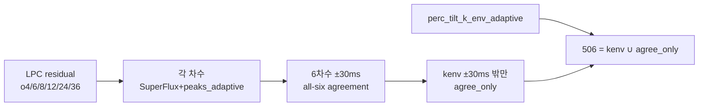

# LPC agreement rescue — 실제 구조량

> 2026-08-11 · 대상: Dir 기준선 + `pipeline_764_batch` 6곡  
> 관련: [`dir_764_pipeline.md`](dir_764_pipeline.md) · 러너: `run_pipeline_764_batch.py`

506-style 정의는 **`kenv_adaptive ∪ LPC-order agreement-only`** 이다.  
이 문서는 LPC가 **몇 점을 후보로 만들고**, 그중 **실제로 506에 들어간 점**이 몇 개인지,  
그리고 그 점이 **전체_adaptive에도 이미 있는지**를 숫자로 정리한다.

---

## 0. LPC가 “구조한다”는 말의 의미

LPC 잔여 자체(o4…o36 SF-adaptive)는 차수마다 수백 점이 나온다.  
506에 직접 들어가는 것은 그 전부가 아니라, 아래 **두 겹의 보수 필터**를 통과한 점뿐이다.

| 단계 | 이름 | 의미 |
|------|------|------|
| A | `lpc_orders` | 차수별 SF-adaptive 피크 (원재료) |
| B | `agreement_all6` | 6차수가 ±30ms 안에 모두 겹친 합의 점 |
| C | `agree_only` | B 중 **kenv에 ±30ms로 안 덮인** 점 → **실제 LPC rescue** |
| D | `p506` | `kenv + agree_only` |

즉 **“LPC로 구조한 양”의 본선 지표는 C = `agree_only`** 이다.  
B가 커도 kenv가 이미 잡고 있으면 rescue는 0에 가깝다.

Dir 참조: kenv 502 + agree_only **4** → conservative 506  
(o12-deburst 21은 보수본에서 제외).

---

## 1. 6곡 + Dir — LPC rescue 요약

| 트랙 | kenv | agree_all6 | 그중 이미 kenv | **agree_only (rescue)** | p506 | rescue / kenv | rescue / 506 |
|------|-----:|-----------:|---------------:|------------------------:|-----:|--------------:|-------------:|
| **Dir** (참조) | 502 | 325† | ≈321 | **4** | 506 | 0.8% | 0.8% |
| AS | 367 | 374 | 330 | **44** | 411 | 12.0% | 10.7% |
| FD | 627 | 544 | 438 | **106** | 733 | 16.9% | 14.5% |
| cry | 231 | 182 | 157 | **25** | 256 | 10.8% | 9.8% |
| GL | 345 | 388 | 270 | **116** | 461 | 33.6% | 25.2% |
| VN | 502 | 93 | 92 | **1** | 503 | 0.2% | 0.2% |
| SS | 471 | 271 | 266 | **5** | 476 | 1.1% | 1.1% |

† Dir `agree` 매니페스트 카운트(fusion counts.agree=325).  
batch 6곡은 `pipeline_detect_manifest.json`의 `agreement_all6`.

### 한줄 해석

- **GL·FD**: LPC rescue가 실질적. GL은 506의 **1/4**가 LPC 추가분.
- **AS·cry**: 중간(≈10%).
- **SS·VN·Dir**: LPC는 거의 안 얹힘(0–5점). kenv가 합의 구간을 이미 대부분 포함.
- **VN**은 agreement_all6 자체가 93으로 빈약하고, 그중 92가 이미 kenv → rescue **1점**.

---

## 2. 차수별 원재료 (A) — 합의로 얼마나 줄었나

| 트랙 | o4 | o6 | o8 | o12 | o24 | o36 | → all6 | 합의율† |
|------|---:|---:|---:|----:|----:|----:|-------:|--------:|
| AS | 486 | 473 | 510 | 529 | 484 | 452 | 374 | ~73% |
| FD | 865 | 1027 | 1106 | 987 | 882 | 783 | 544 | ~53% |
| cry | 258 | 331 | 344 | 329 | 299 | 298 | 182 | ~58% |
| GL | 501 | 513 | 477 | 491 | 472 | 452 | 388 | ~78% |
| VN | 177 | 171 | 206 | 184 | 171 | 239 | 93 | ~45% |
| SS | 360 | 391 | 364 | 371 | 390 | 414 | 271 | ~69% |

† 합의율 ≈ `agreement_all6 / median(order counts)` (대략치).  
개별 차수는 수백 점이어도, **6차수 동시 합의**로 크게 줄어든다.  
VN은 차수 피크 자체도 적고 합의도 약하다.

---

## 3. rescue가 전체_adaptive에도 있는가?

506에 새로 들어간 `agree_only`가, 원곡 `전체_adaptive`와 ±30ms 1:1로 겹치는지를 보면  
**764 통합본 관점에서의 “순수 LPC 신규”**가 드러난다.

| 트랙 | agree_only | 그중 adaptive에도 있음 | **adaptive에 없는 LPC 신규** |
|------|-----------:|----------------------:|-----------------------------:|
| AS | 44 | 40 | **4** |
| FD | 106 | 101 | **5** |
| cry | 25 | 23 | **2** |
| GL | 116 | 110 | **6** |
| VN | 1 | 1 | **0** |
| SS | 5 | 1 | **4** |

### 해석

- 506 내부에서는 LPC가 GL·FD처럼 **수십~백 점**을 보탤 수 있다.
- 그러나 그 점의 대다수는 **전체_adaptive가 이미 잡는 시각**이다.
- 764(`506 ∪ adaptive`) 기준으로 LPC만의 순수 신규분은 곡당 **0–6점** 수준.

즉:

| 질문 | 답 |
|------|-----|
| 506을 kenv만으로 두지 않고 LPC를 얹은 효과? | 곡에 따라 큼 (GL +116, FD +106) / 거의 없음 (VN +1, SS +5, Dir +4) |
| 764 통합본에서 LPC가 새로 연 사건? | **미미** (대개 한 자리) |
| LPC의 주된 역할? | “없는 사건을 대량 발굴”보다, **피아노 축(506) 안에서 kenv 누락을 보수적으로 메움**. 그중 상당수는 구조 축(adaptive)과 시간상 겹침 |

---

## 4. 곡별 메모

- **GL**: rescue 비율 최고. kenv가 합의 구간의 상당수를 놓침(388 중 270만 커버) → LPC가 피아노 축을 두껍게 만듦. 다만 adaptive와는 110/116이 겹침.
- **FD**: 절대 rescue 최대(106). FREEDOM DiVE는 피아노 스템/합의 밀도가 높고 kenv 누락도 큼.
- **AS**: Extended Mix로 길지만 rescue는 중간(44). adaptive 밀도가 매우 높아(2270) 764에서는 LPC 신규가 4점에 그침.
- **cry**: Dir에 가까운 “소량 rescue”(25) 패턴.
- **SS / VN / Dir**: LPC 필터가 거의 통과시키지 않음. **kenv≈506**.

---

## 5. 데이터 위치

| 항목 | 경로 |
|------|------|
| 차수·합의·rescue 카운트 | `out/stems/{alias}/event_sculpt/pipeline_detect_manifest.json` |
| 506↔adaptive 분할 | `out/sonify/pipeline_764_batch/{alias}/{alias}_pipeline_764_manifest.json` |
| 배치 요약 | `out/sonify/pipeline_764_batch/batch_summary.json` |
| Dir fusion | `out/stems/Dir/event_sculpt/pass2/lpc_sf_adaptive_on_piano/fusion_kenv_agree_o12db_on_piano_manifest.json` |

키:

- `peak_times_s.lpc_orders` / `agreement_all6` / `agree_only` / `kenv` / `p506`
- sonify 쪽 `counts.common` · `only_506` · `only_adaptive` 는 506 전체 vs adaptive 분할이며, agree_only 전용 분할은 위 표의 재매칭 결과.

---

## 6. 결론

1. **실제 LPC 구조량 = `agree_only`**. 차수별 수백 점이 아니라, kenv 밖 합의 점만.
2. batch 6곡에서 rescue는 **1–116점**으로 편차가 크고, Dir(+4)와 비슷한 곡(SS·VN)과 크게 쓰는 곡(GL·FD)이 공존한다.
3. 764 관점의 **LPC 전용 신규는 곡당 최대 6점** — 통합본의 뼈대는 여전히 adaptive ∪ kenv.
4. LPC agreement는 “전역 ODF”가 아니라 **506 피아노 축의 보수적 보강**으로 읽는 것이 맞다.

---

## 7. 원곡 LPC→adaptive 시험 (세션 40–41) — 기각

가설: 원곡에 LPC agreement를 돌려 전체_adaptive에 얹으면 저역 누락을 보강할 수 있다.  
산출: `out/sonify/pipeline_764_batch/{alias}/adaptive_orig_lpc_agree/`.

**판정 (세션 41)**: **미채용.**  
저역에 반응은 하나 정확한 저역 사건을 찍지 못함 → **링잉/잔여 반응**.  
통합 기준선은 계속 **기존 764** (`506 ∪ 전체_adaptive`).
