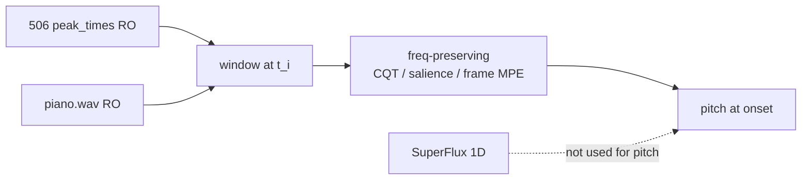

# event_pitch — 주파수 보존 재추정 축 (계획서)

- **작성**: Cursor Grok 4.5
- **일자**: 2026-08-12
- **코드**: [`src/exp/s5_midi/event_pitch/`](../src/exp/s5_midi/event_pitch/)
- **성격**: **기존 764 / via_764에 없는 새 연구 축**의 선포·계획

---

## 0. 선포

764·506은 **“언제”** 만 제공한다. SuperFlux(+bands)는 주파수를 접어 1D 온셋 강도를 만들므로, 피크 시각을 리버스해도 피치가 되살아나지 않는다.

본 축은 같은 \(t_i\)에서 **주파수를 접지 않은** 스펙트럼 해석으로 “무엇이 울렸는지”를 재추정한다.  
검출 파이프라인 확장이 아니라 **onset-conditioned pitch interpretation** 이다.

| | via_764 | **event_pitch** |
|--|---------|-----------------|
| 질문 | 506에 피치를 채워 MIDI? | \(t_i\)에서 접히지 않은 스펙트럼으로 피치 해석 가능? |
| 피치 시도 | pyin·STFT peak·local AMT·fuse 이식 → **no-go** | CQT/salience → (후속) frame MPE |
| 위치 | `s5_midi/via_764/` | `s5_midi/event_pitch/` |

via_764는 **onset 골격 자산**으로 유지한다. 피치 후속 연구는 본 트랙으로 이전한다.

---

## 1. 역할 분담

- **onset**: `conservative_kenv_agree_only` (506) 읽기 전용
- **pitch**: 본 트랙만. SuperFlux 1D 역산·fuse/clip AMT 노트 이식 **금지**
- **경계**: `via_764` / `s4_piano` / 형제 트랙 **import·out 공유 금지**

---

## 2. 입력 (RO)

| 항목 | 경로 |
|------|------|
| Peaks | `out/stems/Dir/event_sculpt/pass2/lpc_sf_adaptive_on_piano/fusion_kenv_agree_o12db_on_piano_manifest.json` → `conservative_kenv_agree_only` |
| Audio (1차) | `out/stems/Dir/bs_roformer/piano.wav` |
| Audio (진단, 후속) | tilt/K-env 소재 — “검출기가 본 변화” vs 피아노 음정 A/B. 1차 mid는 piano만 |
| venv | `s5_midi/clean_amt/env/.venv` (새 venv 없음) |

---

## 3. 방법 (마일스톤)

| 단계 | 내용 | go/no-go |
|------|------|----------|
| **E0** | 트랙·README·scaffold | 완료 |
| **E1** | CQT harmonic salience top-1 | **no-go** |
| **E2** | Basic Pitch `note` 프레임 | **no-go** |
| **E3** | CQT pitch-axis SF (조잡 집계) | **no-go** |
| **E4** | Basic Pitch **`onset`** @ \(t_i\) | **no-go** |
| **E5** | Böck ¼음 필터뱅크 SuperFlux (합산 전) | **no-go** |
| **E6** | 88키 삼각 필터뱅크 SuperFlux | **no-go** |
| **E7** | Onsets&Frames식 / ByteDance 88 onset | **no-go** (정량 최선·음율 실패) |
| **E8–E10** | gated AMT / mask×AMT / fuse×mask | weak / 구조적 한계 (rescue에 피치 없음) |
| **E11** | 분리 레이어(piano/harmonic/synthesis) CQT 합의 @ 506 | **no-go** (합의≠선율; 상관 추정기) |
| **E12** | 독립 추정(CQTΔ vs pyin) + 옥타브 교차 · 선율대역 (v1 §11-b 힌트) | **no-go** (추론 피치·음 불일치) |

### 축 상태 (v1.7)

E1–E12 추정기 구성 = 청취 실패. **원본에서 직접 읽기**만 남음.  
rescue 참조를 채우려면 장기적으로 **자작**에 기울지만 — **당장은 다른 AMT 탐색** (1차: Basic Pitch).  
자작·포크·GT 수집은 메모만 (미착수).

성공 문구(미달): “506 시각의 피치가 원본 선율로 들린다.”  
via_764로 되돌리지 않음 — 준수.

---

## 4. 버전 이력

| ver | 일자 | 내용 |
|-----|------|------|
| **v1** | 2026-08-12 | 선포·E0/E1 |
| **v1.1** | 2026-08-12 | E1/E2 no-go · E3 pitch-SF |
| **v1.2** | 2026-08-12 | E3 no-go · E4–E7 순차 검토 |
| **v1.3** | 2026-08-12 | E4–E7 청취 전량 no-go · **축 종료** |
| **v1.4** | 2026-08-12 | E8–E10 기록 · E11 분리-합의 |
| **v1.5** | 2026-08-12 | E11 **no-go** · E12 독립교차 |
| **v1.6** | 2026-08-12 | E12 **no-go** · 추론≠원본 데이터 교훈 |
| **v1.7** | 2026-08-12 | 자작=장기 기울기 메모 · **AMT 탐색(BP)** 우선 |
