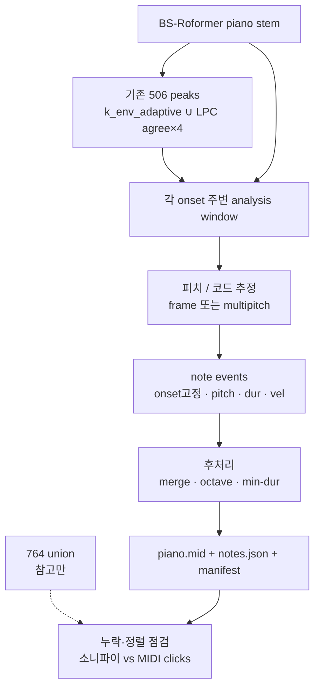

# Dir 764/506 파이프라인 활용 — 피아노 스템 → MIDI 제안서

- **작성**: Cursor Grok 4.5
- **일자**: 2026-08-12
- **성격**: [`dir_764_pipeline.md`](dir_764_pipeline.md)를 **전제·자산**으로 한 MIDI 경로 제안
- **관계**: [`piano_stem_to_midi_plan_cursor_grok_4.5.md`](piano_stem_to_midi_plan_cursor_grok_4.5.md)(클린 슬레이트 AMT)와 **별개**. 통합·선택 비교는 후속 결정 사항
- **범위**: 계획 + **코드 트랙 개설**. D0 구현은 [`s5_midi/via_764/`](../src/exp/s5_midi/via_764/)
- **소스·조달 보완 (본문 비개정)**: [`piano_midi_sources_v1_cursor_grok_4.5.md`](piano_midi_sources_v1_cursor_grok_4.5.md) — Bach dry·Dir stem 재사용, GT 페어 wishlist. 규율 원문: `E:\game\Music Hermeneutic AI\audio\control\README.md`
- **코드 배치**: [`s5_midi/via_764/`](../src/exp/s5_midi/via_764/) — clean_amt·midi_fuse·stem_norm과 **분리**. **D0 완료**. **D1** = 파일럿 30–60s pyin top-1 피치 채움. D2+ 미착수.

---

## 1. 한 줄 요약

이미 Dir에서 검증된 **피아노 타건 시각(506)** 과 통합 사건(764)을 **onset 골격**으로 고정하고, bs_roformer 피아노 스템에서 **피치·지속·벨로시티만** 채워 MIDI를 만든다.

클린 슬레이트(종단간 AMT)와 달리, “언제 쳤는가”는 프로젝트 사건 파이프라인에 위임하고, MIDI 단계는 “무엇을·얼마나 길게”에 집중한다.

---

## 2. 왜 764 문서를 전제로 하는가

[`dir_764_pipeline.md`](dir_764_pipeline.md)의 역할 분담:

| 층 | n | MIDI 관점 역할 |
|----|--:|----------------|
| **506** | 506 | **피아노 건반 onset 후보** — MIDI note-on 시각의 1차 골격 |
| **전체_adaptive** | 679 | 저역·구조 — 피아노 MIDI의 주골격으로는 비권장 |
| **764** | 764 | 506∪adaptive — 전곡 사건 기준선. MIDI에는 **조건부** 사용 |

청취 판정(세션 38): **506 = 피아노**, adaptive = 저역 비트·기타 구조.  
따라서 **피아노 MIDI의 기본 onset 집합은 506**이다. 764는 “전곡 정렬·구간 탐색·누락 점검”용으로 두고, note 나열에 그대로 넣지 않는다(adaptive-only 258이 피아노 타건이 아닐 수 있음).

---

## 3. 핵심 가설

1. Dir에서 가장 비싼 문제(피아노 onset 탐지)는 **이미 506/합의 구조로 상당 부분 풀렸다**.
2. 종단간 AMT를 처음부터 쓰면, 기존에 맞춘 onset과 **이중으로 싸우게** 된다(정렬·중복·누락 재협상).
3. 506 시각을 고정한 뒤 스템 구간에서 피치만 추정하면, **재현·디버그·소니파이 루프**가 기존 764 워크플로와 맞물린다.

실패 시 가설 수정: 506이 “타건”이 아니라 “어택성 잡음/페달 이벤트”를 많이 포함하면, 피치 단계가  thrash → 그때만 클린 AMT 또는 506 정제와 병행.

---

## 4. 제안 아키텍처

### 4.1 Onset 소스 정책

| 모드 | onset 집합 | 용도 |
|------|-------------|------|
| **P0 (기본)** | **506 only** | 피아노 MIDI 본선 |
| P1 (진단) | 506 ∪ (764의 506-only/common만) | 사실상 506과 동일에 가까움 — 스키마 검증용 |
| P2 (탐색) | 764 전체 | **하지 않음**(기본). adaptive-only가 건반으로 오인될 위험 |
| P3 (rescue) | 506 + stem합의 234 중 764 missed | 선결 missed 2 등 소수만 수동/반자동 보강 |

기본은 **P0**. P3는 [`dir_764_pipeline.md`](dir_764_pipeline.md)의 missed 2(`1:22.039`, `1:32.816`) 청취 후 건반이면 가산.

### 4.2 윈도우·피치 채우기

각 506 시각 \(t_i\)에 대해:

1. **분석 창**: \([t_i - pre,\ t_i + post]\) (초안: pre 20–40ms, post 80–150ms; 실험으로 고정)
2. 창 안 피아노 스템에서:
   - **단음 가정 구간**: YIN/pYIN 또는 스펙트럼 peak → MIDI note
   - **화성/겹침**: multipitch (Salience / NN multipitch / 짧은 구간 AMT frame) → 상위 K피치
3. **note-off**:  
   - 다음 onset 직전, 또는  
   - 에너지/고조파 붕괴, 또는  
   - 고정 max duration 캡  
   중 정책을 하나로 고정 후 A/B
4. **velocity**: 창 에너지 또는 K-weight 소재 피크 높이 → 1–127 맵 (상대 스케일이면 충분)

### 4.3 후처리 (최소)

- 동일 pitch·근접 onset merge (±15–30ms) — 506 자체는 이미 gap이 있으나 피치 중복 방지
- 옥타브 오류 후보 플래그(배음비) — 자동 교정은 옵션
- 최소 duration / 최소 velocity 컷
- **템포 양자화는 1차 비활성** (기존 사건 시각과 충돌; soft quantize는 별 런)

---

## 5. 기존 파이프라인과의 접점

구현 시 **새 ODF를 만들지 않는다**. 재사용·참조만 한다.

| 자산 | 경로·개념 (문서 기준) | MIDI 단계 사용 |
|------|------------------------|----------------|
| 506 정의 | perc_tilt_k_env_adaptive(502) ∪ LPC agree×4 | onset 리스트 |
| k_env 러너 | `run_tilt_k_env_adaptive.py` | 재현·벨로시티 소재 후보 |
| LPC agree | `run_lpc_order_agreement_on_piano.py` | 506 재현 |
| fusion | `run_fusion_kenv_agree_o12_on_piano.py` / `conservative_kenv_agree_only` | 피크·매니페스트 |
| 764 매칭 | `one_to_one_time_match` ±30ms | MIDI onset vs adaptive 역할 분리 점검 |
| 소니파이 | lowpiano / freqsep / unified 3k·5k | MIDI 클릭 vs 506 클릭 A/B |
| stem 합의 234 | coverage·missed | 누락 건반 rescue 후보 |

산출 MIDI 클릭을 **5k(506 계열)** 톤으로  overlays하면, 기존 freqsep 청취 습관과 맞출 수 있다.

---

## 6. 클린 슬레이트 제안과의 차이

| | 클린 슬레이트 AMT | 본 제안 (764/506 활용) |
|--|-------------------|-------------------------|
| onset | 모델이 결정 | **506이 결정** |
| 의존성 | 외부 AMT 중심 | 기존 Dir 사건 + 피치 모듈 |
| 디버그 | note 전체를 한 번에 | 시각 고정 → 피치만 청취 |
| 위험 | 기존 506과 불일치 | 506 오탐이 곧 잘못된 note-on |
| 적합 | 사건 파이프라인 없는 트랙 | **Dir처럼 506이 이미 있는 트랙** |

병행 전략(선택, 본 문서 범위 밖 결정):

- 동일 구간에 클린 AMT 1런을 돌려 **onset 합의율**(±30ms)만 측정 → 506 신뢰도 교차검증
- 합의 onset만 쓰거나, AMT-only onset을 P3 rescue 후보로

---

## 7. 실험 설계 (Dir 고정)

### 7.1 입력

- 오디오: BS-Roformer piano stem (Dir)
- onset: `conservative_kenv_agree_only` / fusion 506 피크 시각 (재현 가능한 매니페스트 키)

### 7.2 파일럿 구간

기존 소니파이·합의 문서와 맞추기 쉬운 구간을 우선:

1. 타건이 분명한 30–60초
2. 밀집·페달 의심 구간
3. (선택) missed 2 전후 수 초 — P3 필요 여부 판정

### 7.3 비교 축 (한 번에 하나)

| 축 | 수준 |
|----|------|
| 피치 추정기 | 단음 pYIN vs multipitch vs 짧은 창 NN |
| note-off 정책 | next-onset vs energy-decay vs fixed cap |
| 화성 K | top-1 vs top-2 vs top-3 |
| onset 집합 | P0(506) vs P0+P3(miss rescue) |

### 7.4 판정

정량 GT가 없으면:

1. **시간**: MIDI note-on ↔ 506 피크 대응률 (설계상 ≈100%여야 함; 필터로 줄인 경우만 기록)
2. **청취**: 피아노 스템 bed + MIDI 클릭 / 또는 MIDI 렌더 vs stem
3. **편집성**: “506 클릭만 들을 때보다 MIDI 피아노 롤이 수정하기 쉬운가”
4. (교차) 클린 AMT 대비 수동 수정 예상 시간 — 주관이어도 런마다 한 줄

---

## 8. 산출물 계약

| 파일 | 내용 |
|------|------|
| `piano_from_506.mid` | Format 0/1, ch0 piano |
| `notes.json` | `onset_s`(=506), `offset_s`, `pitch`, `velocity`, `source_peak_id` |
| `manifest.json` | 506/764 매니페스트 해시·키, 피치 모듈명/버전, 창·K·note-off 정책 |
| `sonify_midi_on_lowpiano.wav` | 기존 low_g0p20 bed + MIDI 유도 클릭 |
| `alignment_vs_506.json` | 설계 검증용(필터 전후 n) |

`run_id` 예: `20260812_grok45_506onset_pyin_top2_energyoff`

---

## 9. 리스크와 완화

| 리스크 | 완화 |
|--------|------|
| 506이 건반이 아닌 어택 | 구간별 청취; 의심 피크는 MIDI 제외 플래그; P3만 신중 추가 |
| 동시 타건을 top-1이 놓침 | top-K + 청취; 필요 시 창 안만 국소 AMT |
| note-off가 다음 타건에 잘림 | 페달성 구간은 energy-decay 우선 런 |
| 764를 onset에 넣어 저역이 건반화 | **기본 P0 고수**; 764는 점검·소니파이만 |
| 기존 러너·경로 변경 부담 | 피크는 **읽기 전용** 소비; fusion 재학습/재검출은 MIDI 성공 후로 미룸 |
| 벨로시티 무의미 | 상대 맵만; 표현 품질은 비목표 |

---

## 10. 마일스톤

| 단계 | 산출 | 완료 조건 |
|------|------|-----------|
| D0 | 506 피크 로드 → 빈 velocity 클릭 MIDI | n≈506, 시각이 기존 클릭과 ±0(또는 샘플 오차) |
| D1 | 단음/top-1 피치 채움 파일럿 구간 | 롤에서 멜로디 윤곽 식별 가능 |
| D2 | top-K + note-off 정책 1종 고정 | 화성 구간 청취 go/no-go |
| D3 | 전곡 506 → MIDI + lowpiano 소니파이 | manifest로 재실행 가능 |
| D4 | missed 2 / 합의 234 대비 점검 | P3 필요 여부 문서화 |
| D5 | (선택) 클린 AMT와 onset ±30ms 합의표 | 병행 가치 판단 자료 |

**go**: D2–D3에서 “스템 듣고 롤을 고치는” 비용이 처음부터 치는 것보다 낮음  
**no-go**: 피치 오탐이 onset 고정의 이득을 상쇄 → 창·K 재설계 또는 클린 AMT로 이관

---

## 11. 명시적 비범위

- 506/764 검출기 재설계·o12-deburst(527) 재도입
- adaptive-only 258의 피아노화
- 드럼/구조 사건을 별도 MIDI 트랙으로 보내는 작업(원하면 764 기반 **별 제안**)
- MusicXML/악보, 페달 CC 고품질화
- 클린 슬레이트 문서의 환경·모델 선정을 본 문서가 대체하는 것

---

## 12. 다음 액션

1. 506 피크·매니페스트 키를 **읽기 전용**으로 소비하는 D0 스크립트 범위만 확정
2. 파일럿 구간 타임스탬프 지정 (기존 소니파이와 공유)
3. 피치 모듈 1개로 D1 → 청취 후 top-K/note-off 축 진입
4. 클린 슬레이트 제안과 **병행할지·Dir만 이 경로로 갈지**는 D2 결과로 결정

이 문서는 [`dir_764_pipeline.md`](dir_764_pipeline.md)의 사건 층을 MIDI onset 골격으로 쓰는 **별도 경로** 제안이다.
